# Money Tracker (public template)

> **This repo is ready to use as-is** — run the dashboard on fictional demo data immediately.  
> **It is also ready to hand to an AI agent** (Cursor, Copilot, Claude Code, …): open the project, point the agent at [`docs/AGENTS.md`](docs/AGENTS.md), and ask it to walk you through installation and wiring your real banks and asset reports.

Personal expense tracking with a CSV pipeline, trip **sequences**, asset snapshots, and an interactive **Dash** dashboard. This is a sanitized template: it ships with **fictional demo data** and only a reference **N26 CSV reader**. Bank- and broker-specific parsers are omitted so you can add your own formats without exposing private account details.

## Demo app snapshots

Screenshots captured from the bundled demo (12 transactions, fictional asset balances ~**€25.7k** total). Tab order matches the dashboard: **Assets Overview** (default), **Expenses**, **Sequences**, **Data & Mappings**.

### Teal (light)

| Assets | Expenses |
|--------|----------|
| 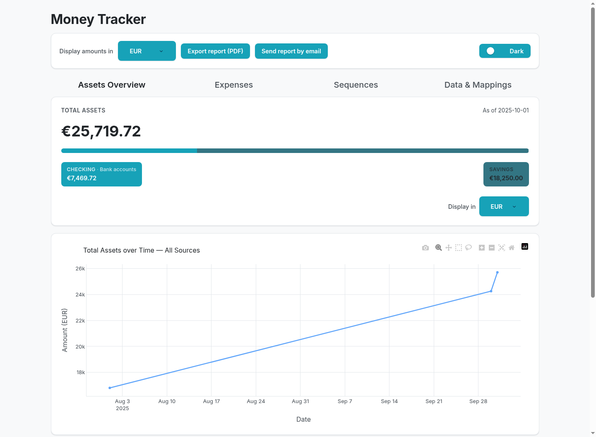 | 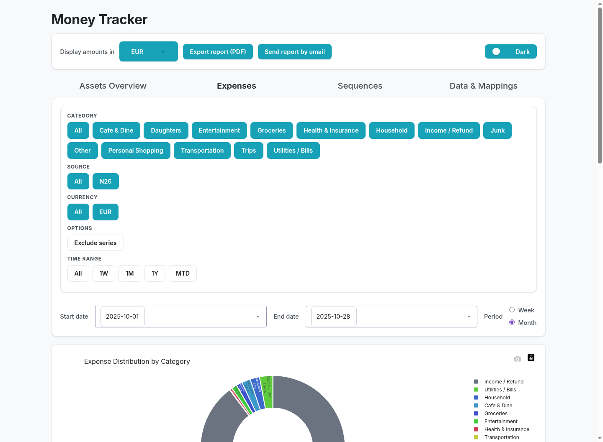 |

| Sequences | Data & mappings |
|-----------|-----------------|
| 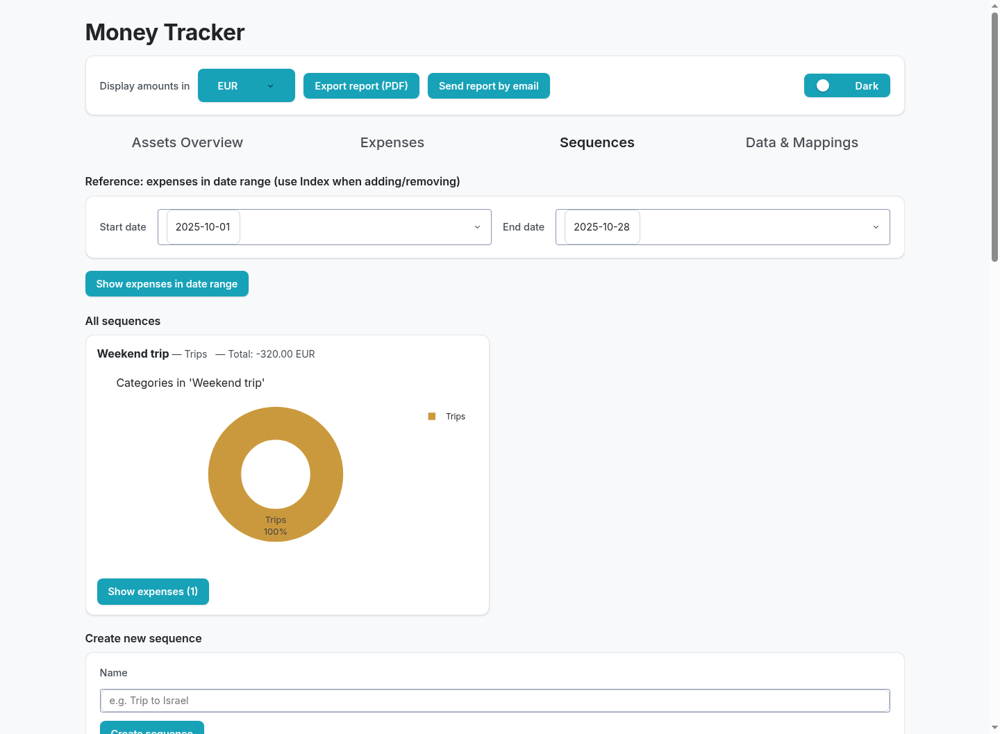 | 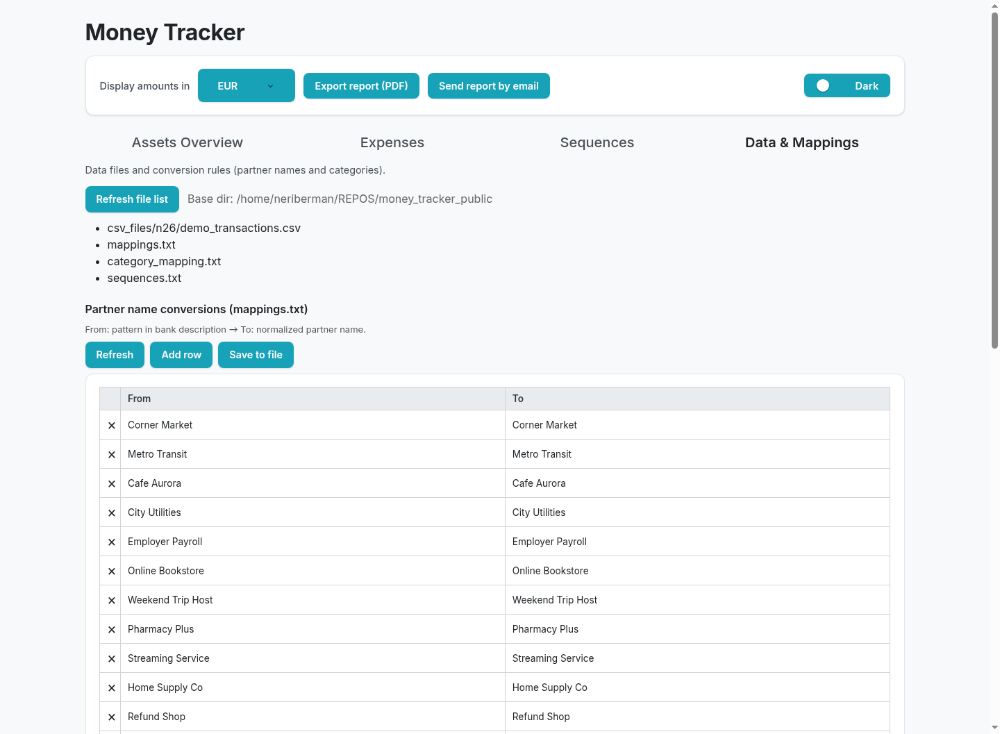 |

### Dark

| Assets | Expenses |
|--------|----------|
| 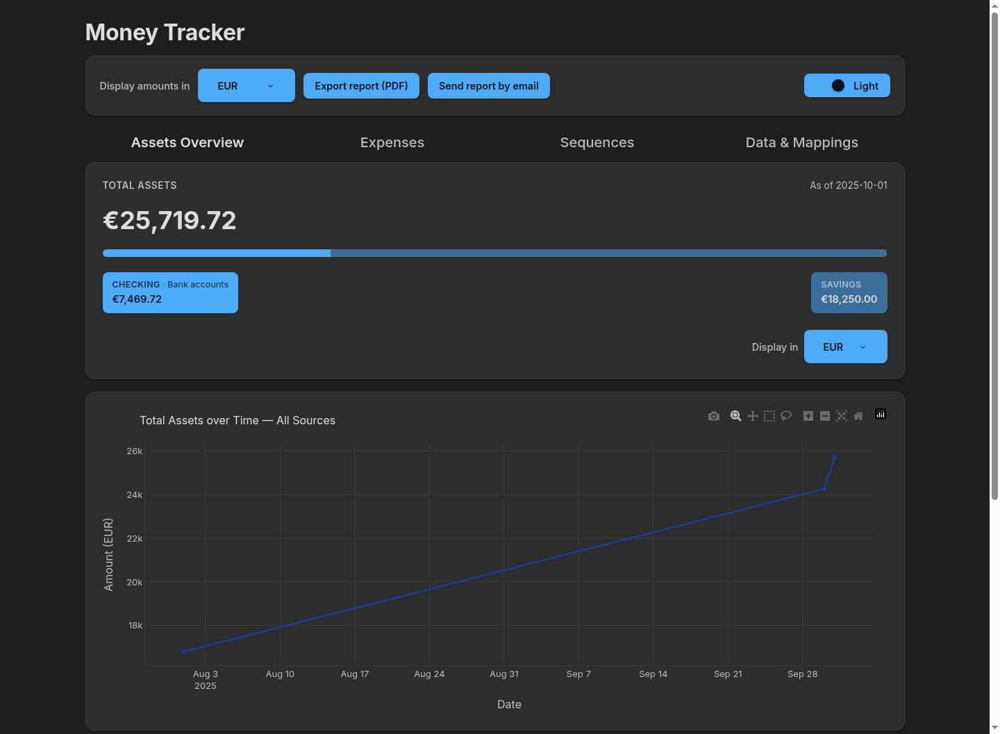 | 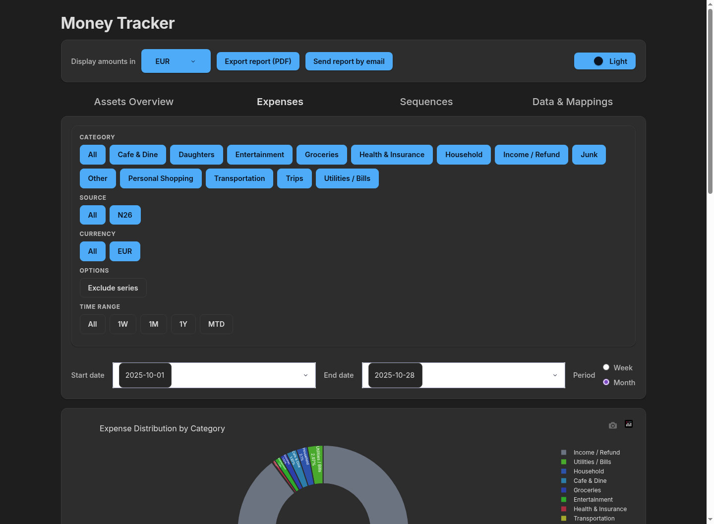 |

| Sequences | Data & mappings |
|-----------|-----------------|
| 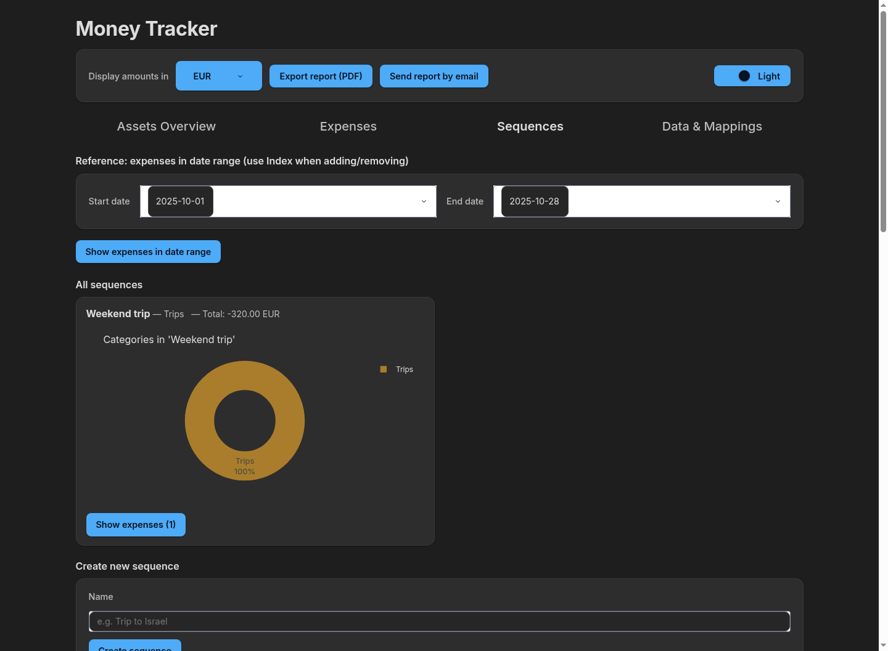 | 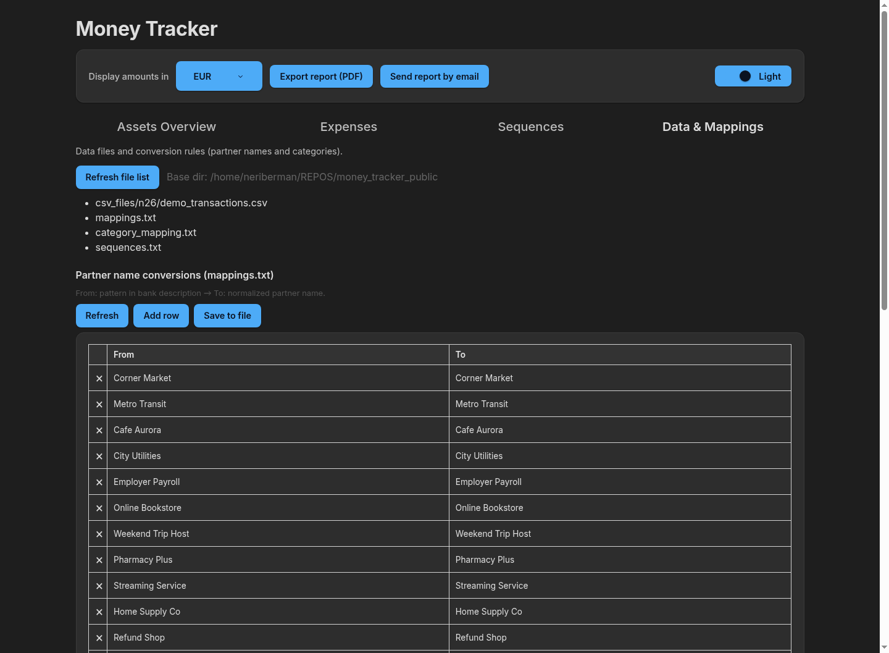 |

Regenerate after UI changes:

```bash
python scripts/capture_readme_screenshots.py
```

## Quick start

```bash
git clone <your-public-repo-url>
cd money_tracker_public
pip install -r requirements.txt
python -m money_tracker.dashboard
```

Open http://127.0.0.1:8050 — demo transactions load from `csv_files/n26/demo_transactions.csv`.

If port 8050 is already in use (e.g. another local instance):

```bash
MONEY_TRACKER_PORT=8051 python -m money_tracker.dashboard
```

Optional helper script (repo-only, no Google Drive paths):

```bash
bash scripts/start_local_dev.sh
```

## How data is processed

Two pipelines feed the dashboard. Format-specific logic lives only in **readers** (expenses) and **parsers** (asset reports).

### Expense / checking CSV pipeline

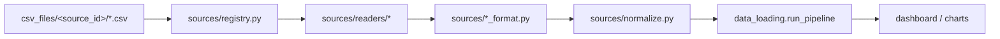

Steps:

1. **Discover** — `sources/loader.py` walks `csv_files/` (subfolder name = `source_id`).
2. **Read** — registry picks a `BankReader` (`n26` is bundled; add yours for other banks).
3. **Normalize** — rows become canonical columns (`Partner Name`, `Booking Date`, `Amount (EUR)`, …).
4. **Pipeline** — dedupe, partner mappings (`mappings.txt`), categories (`category_mapping.txt`), optional settlement filter.
5. **Dashboard** — charts, table, sequences, reports.

### Asset balance pipeline

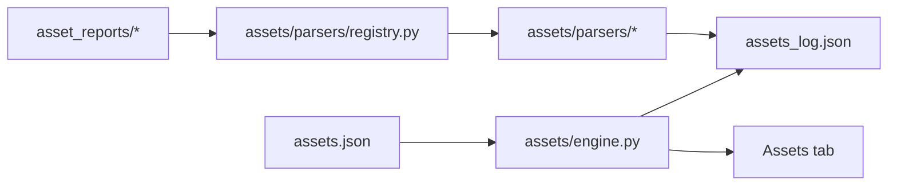

Steps:

1. **Register assets** — `assets.json` lists each account, currency, optional `parser` and `expense_source_id`.
2. **Ingest reports** — engine scans `asset_reports/`, runs the matching parser, appends snapshots to `assets_log.json`.
3. **Project bank balances** — checking assets with `expense_source_id` add CSV transaction deltas since the latest snapshot anchor.
4. **Overview** — totals, history charts, and % change on the Assets tab.

### End-to-end view

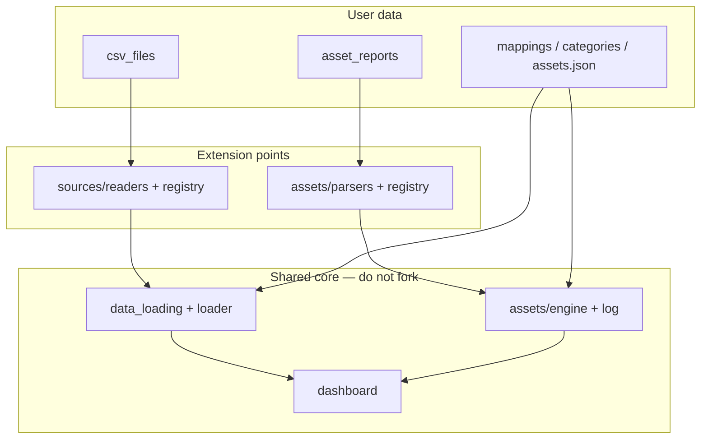

## Working with an AI agent

Give your agent this repo and say something like:

> “Read `docs/AGENTS.md` and help me replace the demo data with my accounts. Ask me for samples before writing any interpreters.”

The agent should:

1. **Verify installation** — dependencies, dashboard on demo data, port conflicts.
2. **Ask you for samples** — one redacted export per checking/card source; one redacted report per asset type (PDF/Excel showing balance + as-of date).
3. **Implement interpreters** — new modules under `sources/readers/`, `sources/*_format.py`, and `assets/parsers/`; register them; add tests.
4. **Wire your config** — `csv_files/`, `assets.json`, mappings, optional `.env`.
5. **Run tests** and confirm the dashboard shows your data.

Full step-by-step checklist: **[docs/AGENTS.md](docs/AGENTS.md)**

## What you get out of the box

| Included | Purpose |
|----------|---------|
| `csv_files/n26/demo_transactions.csv` | Fictional N26-shaped export (12 rows) |
| `mappings.txt`, `category_mapping.txt` | Partner normalization and categories |
| `permitted_categories.txt` | Allowed category labels |
| `assets.json` | Two demo assets (checking + savings) |
| `assets_log.json` | Fictional balance snapshots (~€7.5k checking projected, ~€18.3k savings) |
| `sequences.json` | Sample trip sequence |
| `exchange_rates.json` | FX rates for multi-currency views |
| `docs/screenshots/` | Demo UI captures for this README |

## Configuration (`.env`)

The app runs **without** a `.env` file. Copy the template when you want optional features:

```bash
cp .env.example .env
```

| Variable | Required for | Notes |
|----------|--------------|-------|
| `GEMINI_API_KEY` | AI auto-categorization | [Google AI Studio](https://aistudio.google.com/apikey) |
| `GMAIL_USER`, `GMAIL_APP_PASSWORD`, `REPORT_EMAIL_TO` | Email reports | [Gmail app password](https://support.google.com/accounts/answer/185833) |
| `MONEY_TRACKER_*` | Custom paths / server | See `.env.example` |

If a feature needs a missing or placeholder value, the UI and API raise clear errors pointing you to `.env.example`.

## Adding your banks and asset reports

Format-specific code lives in dedicated modules — the rest of the app stays unchanged.

### Checking / expense CSV exports

1. Add `money_tracker/sources/readers/<bank>.py` (implement `BankReader.read`).
2. If needed, add `money_tracker/sources/<bank>_format.py` to map columns to the [canonical schema](money_tracker/sources/schema.py) (N26 export is the reference shape).
3. Register the reader in `money_tracker/sources/registry.py`.
4. Copy `sources.yaml.example` → `sources.yaml` and set `reader:` per folder under `csv_files/`.
5. Drop your exports in `csv_files/<source_id>/`.

See [docs/dev-multi-source.md](docs/dev-multi-source.md).

### Asset balance reports (PDF, Excel, …)

1. Add `money_tracker/assets/parsers/<format>.py`.
2. Register in `money_tracker/assets/parsers/registry.py`.
3. Point each asset at a parser in `assets.json`.

See [docs/adding-parsers.md](docs/adding-parsers.md).

## Project layout

```
csv_files/           # Bank CSV exports (subfolder per source_id)
asset_reports/       # Balance/holdings reports for asset parsers
assets.json          # Asset registry
assets_log.json      # Balance snapshot history
mappings.txt         # Partner name normalization
category_mapping.txt # Partner → category
sequences.json       # Trip / event sequences
money_tracker/       # Application code
  sources/           # CSV readers + loader
  assets/            # Asset engine + report parsers
  dashboard.py       # Dash UI entry point
docs/
  AGENTS.md          # AI agent onboarding playbook
  screenshots/       # Demo UI captures
```

## Dashboard features

- **Expenses** — filter by date, category, and period (week/month).
- **Assets** — track balances; bank accounts can follow CSV transaction totals.
- **Sequences** — group expenses into trips or events.
- **Data & mappings** — edit partner and category rules.
- **Reports** — export PDF or email HTML summary (email requires `.env`).

## PDF export on Linux/WSL

WeasyPrint may need native libraries:

```bash
conda install -c conda-forge pango cairo gdk-pixbuf2
# or: sudo apt install libpango-1.0-0 libpangocairo-1.0-0 libcairo2 libgdk-pixbuf2.0-0
```

## Tests

```bash
PYTHONPATH=.:tests pytest tests -q -k "not browser"
```

## Private vs public workflow

Keep your real exports, account numbers, and institution-specific parsers in a **private** repository. Publish sanitized changes to this public template (separate repo or filtered mirror) — branches alone cannot hide data on a public remote.
